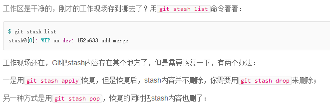

# 常用操作：

## 分支基本操作(branch、checkout)
- git branch dev  
创建分支
- git checkout dev  
切换分支
- git checkout -b dev  
在当前分支基础上建立一个新分支(dev)，并切换到新分支
- git branch -vv  
查看当前详细分支信息（可看到当前分支与对应的远程追踪分支）
- git branch -d dev  
删除本地分支(当然，删除之前必须切换到其他分支)
- git push origin --delete dev2  
= git push origin :dev(推送空分支相当于删除)  
删除远程仓库分支
- 查看本地分支
- git branch -a  
查看本地与远程仓库分支
- git branch -r  
查看远程仓库分支(可以切换到远程分支中查看远程仓库的分支情况，如git checkout origin/master)

## 远程仓库基本操作(remote)
- git remote -vv  
git remote -v  
查看当前远程仓库信息
- git remote add origin xxx.git
添加远程仓库
- git branch --set-upstream-to=origin/remote_branch  your_branch 
将本地分支与远程仓库分支关联起来

## 提取(fetch)、拉取(push)
- git fetch <远程主机名> <远程分支名>  
将远程主机的某个分支提取到本地仓库中，如将远程master分支更新到**本地仓库的远程分支**origin/master中  
- git fetch <远程主机名>  
将远程仓库的所有分支提取到本地仓库中
- git pull <远程主机名> <远程分支名>:<本地分支名>  
提取远程主机某个分支的更新，再与本地的指定分支合并
- git pull <远程主机名> <远程分支名>  
提取远程主机某个分支的更新，再与本地的当前分支合并
- git pull <远程主机名>  
本地的当前分支自动与对应的origin主机"追踪分支"（remote-tracking branch）进行合并(当前分支与远程分支已存在追踪关系)
- git pull  
当当前分支只与一个远程主机的分支建立跟踪关系时时，可如此简写
- git pull origin next = git fetch origin next + git merge origin/next

## 推送操作(push)
- git push <远程主机名> <本地分支名>:<远程分支名>  
推送的标准格式
- git push  
将当前分支推送到默认主机(默认为origin)的对应分支上(已经关联)
- git push -u origin master  
将本地的master分支推送到origin主机，同时指定origin为默认主机，后面就可以不加任何参数。-u指定默认主机
- git push origin master  
将本地的master分支推送到origin主机的master分支。如果远程主机的master不存在，则会被新建。 
- git push --all origin  
将所有本地分支都推送到origin主机
- push成功后会同步更新本地仓库的远程分支

## 回退操作(reset)
#### git的三个区
工作区（Working Directory）：没有修改、修改后未使用git add的文件  
暂存区（Staged）：新增/修改后的文件调用git add后都会被添加到暂存区  
提交区（Commit）：所有添加到暂存区里的文件通过git commit之后会被统一添加到提交区，作为一次提交
#### HEAD指针
HEAD指针指向的是最新的提交节点(版本)。而HEAD^代表的是前一次的提交节点，而HEAD\~2代表的是前两次的提交节点。即HEAD^^=HEAD\~2。
#### 本地回退
git reset --soft HEAD^：将最近一次提交节点的提交记录回退到**暂存区**  
git reset --mixed HEAD^ = git reset HEAD^：将最近一次提交节点的提交记录回退到**工作区**  
git reset --hard HEAD^：将最近一次提交节点的提交记录**全部清除**，完全回退到上个节点 
#### 远程回退
本地与远程同步回退(先本地后远程)  
git reset --hard HEAD^  
git push -f (-f表示强制推送，因为reset之后本地库落后于远程库一个版本，因此需要强制提交。) 
#### 本地库回退到远程库版本(如别人回退了远程库，你同步回退)
git checkout master  
git reset --hard origin/master
#### 如果遇到别人在master回退了版本，导致你提交到master的commit丢失
可以在自己的当前工作分支中新建并切换到一个分支，回退到自己最后一次merge到master的commit，再次merge到master上，再次push即可。  
参考:https://blog.csdn.net/wuhounuanyangzhao/article/details/79816171

## 查看历史
git log  
可以显示所有提交过的版本信息  
git reflog  
可以查看所有分支的所有操作记录（包括已经被删除的 commit 记录和 reset 的操作）

## 管理修改(主要针对当前工作没完成想修改以前的内容)
- git checkout -- file  
丢弃工作区修改，回退到暂存区（如果暂存区不为空）或版本库最新版本（暂存区为空，即commit之后没有add操作）

- git stash
Git还提供了一个stash功能，可以把当前工作现场“储藏”起来，等以后恢复现场后继续工作  
将当前工作区保存，切换到别的分支先修复bug，然后再回到原分支恢复工作区  

 

# 注意事项：
- git中一个本地分支只能与远程主机的一个分支建立联系。
- git branch -vv 查看本地分支与远程分支的跟踪情况
- .git文件夹中的config文件中可看到远程分支的情况
- git clone的原理说明  
https://blog.csdn.net/Hungryof/article/details/86521835  
git clone默认会把远程仓库的master给clone下来，在本地默认创建一个已与远程建立关联的HEAD(默认master)分支，其他分支是隐藏的。  
如果远程还有其他的分支，此时用git branch -a查看所有分支。  
此时若想让其他分支出现，可以  
git checkout -t origin/dev = git checkout -b dev origin/dev = git checkout dev  
上面的3个操作时一致的，会从origin上下载其他分支  
参考来源:https://www.jianshu.com/p/0fe715a7fbb3

# git详细介绍

- 介绍git网站  
阮一峰：http://www.ruanyifeng.com/blog/2014/06/git_remote.html

- git结合实际，比较实用  
廖雪峰：https://www.liaoxuefeng.com/wiki/896043488029600

- git API网站  
易百教程：https://www.yiibai.com/git

